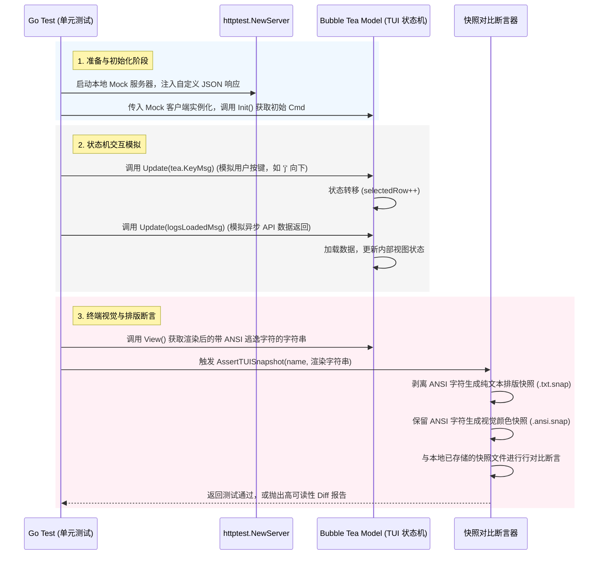

# LiteLLM CLI TUI 测试与快照框架需求规范

## Problem Frame
目前 LiteLLM CLI 利用 Bubble Tea 构建了丰富的交互式终端界面（如 `logs` 日志详情、`stats` 统计仪表盘），但这些 TUI 组件目前处于**零测试覆盖**状态。像 `cmd/logs.go` 这样体积巨大（88KB）的文件，包含了复杂的按键交互、翻页滚动、异步 API 数据加载以及多种视图切换状态机，任何微小的代码调整或重构都极易引发未知的回归 Bug。

我们需要建立一套**轻量级、确定性强、运行极快**的 TUI 测试基建，能够对 `tea.Model` 的状态转移进行精确校验，并对终端渲染的排版及样式（包含颜色）进行快照比对，为后续的高风险重构提供强有力的安全网。

## 架构与测试流程

下面的时序图展示了单元测试如何与 Mock API 服务器、TUI 状态机以及快照断言引擎协同工作，实现无终端依赖的视觉与逻辑双重验证：

## Requirements

### TUI 状态机测试能力 (TUI State-Machine Testing)
- **R1. Headless 测试运行**: 测试必须完全在 Go `testing` 标准环境下对 `tea.Model` 进行，不需要分配真实的物理终端或 TTY 设备。
- **R2. 消息与按键事件模拟**: 测试框架须提供便利的辅助函数，支持手动向 Model 投递各类 `tea.Msg`，包括按键消息 `tea.KeyMsg`（模拟键盘输入）以及自定义的数据载荷消息（模拟网络数据异步加载成功）。
- **R3. 状态与指令断言**: 单元测试必须能直接读取 `Update` 后的 Model 内部关键状态（如当前焦点行、过滤字符、视图模式等），并支持断言 `Update` 返回的 `tea.Cmd` 是否符合预期（如退出时是否返回了 `tea.Quit`）。
- **R12. 异步时序与定时器 Mock 契约**: 针对包含 `tea.Tick` 定时刷新的 Model，其初始化工厂函数必须支持注入模拟的时间源，或者将定时器触发的 Msg 暴露为公开类型，以便在单元测试中可以通过测试代码显式、精准地投递该消息，实现对时间流逝的 100% 确定性模拟，防范由于时间差导致的测试脆弱性 (Flakiness)。

### 双重快照比对与视觉校验 (Dual Snapshot Comparison & Visual Verification)
- **R4. 声明式快照断言**: 框架须提供声明式断言方法 `AssertTUISnapshot(t *testing.T, snapshotName string, viewOutput string)`，用于比对 `View()` 渲染出的终端字符串。
- **R5. 双重快照机制**: 每次断言须在项目 `cmd/testdata/snapshots/`（或相关测试目录）中自动管理并比对两个对应的快照文件：
  - `<snapshotName>.ansi.snap`：**保留完整的 ANSI 逃逸字符（颜色与样式）**，用于确保终端的视觉色彩、加粗、下划线等表现完全符合预期。
  - `<snapshotName>.txt.snap`：**剥离所有 ANSI 转义字符的纯文本排版快照**，在 Git 提交和 Code Review 中提供极佳的可读性，专门用于清晰展现文字排版、列宽、行布局的变化。
- **R10. 色彩 Profile 强制锁定**: 在快照测试初始化时，测试代码必须强制锁定一致的终端色彩 Profile（例如显式调用 `lipgloss.SetColorProfile(termenv.TrueColor)`），确保无论在本地终端环境，还是在无 TTY/非交互式的 CI 容器（如 GitHub Actions）中运行测试，渲染生成的 ANSI 转义字符完全一致，杜绝色彩检测漂移导致快照比对在 CI 中频繁失效。
- **R6. 一键录制与更新**: 当排版发生合理变化时，框架须支持通过环境变量（如运行 `UPDATE_SNAPSHOTS=true go test ./...`）一键自动录制、生成和更新所有受影响的快照文件，无需手动编辑。若不设置该变量且快照不匹配，测试必须报错失败并打印清晰的差异 diff。

### API 请求 Mock 与隔离 (API Mocking & Isolation)
- **R7. 动态 HTTP Mock 隔离**: 框架必须与 Go 原生 `httptest.NewServer` 深度集成。测试用例能够动态拉起本地 Mock 服务器并注入到 `client.Client` 中，支持根据不同的测试场景动态编写响应的 JSON 报文。
- **R8. 零真实网络依赖**: 测试运行期间严禁发出任何真实的网络请求，必须 100% 访问本地 Mock 端点。这确保了测试的高隔离性与极致运行速度（单测须在毫秒级内完成，防范 Flakiness）。
- **R11. 极速内存 Mock 网关 (可选优化)**: 测试框架除了支持 `httptest.NewServer` 外，还应支持通过在内存中劫持 `http.Client.Transport`（即自定义 `http.RoundTripper`）的方式，实现 100% 内存中的网络请求拦截与 Mock 响应，彻底规避本地 TCP 端口冲突及握手延迟，确保单测达到极致的毫秒级速度。

### 解耦与契约设计 (Decoupling & Contract Design)
- **R9. 状态机与 Cobra 命令行解耦**: 必须对 `cmd/logs.go` 和 `cmd/stats.go` 等巨型文件进行轻量级解耦，将 `tea.Model` 及其相关的 `Init/Update/View` 从 Cobra 命令的闭包执行流中分离。Model 必须能够通过统一的工厂函数（例如 `NewLogsModel(client, ...)`）暴露，使其可以被单元测试独立导入并实例化。

## Success Criteria
- **SC1. 核心交互覆盖**: 我们能够为 logs TUI（目前最复杂的组件）编写多个单元测试，完整覆盖“默认列表加载 -> 按键向下滚动 -> 输入关键字过滤 -> 按 Enter 查看详情 -> 按 Esc 返回”的复杂闭环交互。
- **SC2. 秒级运行断言**: 本地运行 `go test ./cmd/...` 验证整个 TUI 状态转移和快照对比应在 2 秒内完成。
- **SC3. 精准变动拦截**: 当修改 TUI 样式（如边框字符、Lipgloss 颜色）或数据排版布局时，快照测试能够立刻精准拦截，并在测试报告中指出精确到字符级的变动 diff。

## Scope Boundaries
- **非目标 (Non-Goals)**:
  - **不引入虚拟终端仿真**: 我们不通过 `expect`、pty 伪终端或 Headless Chrome 等重量级工具运行完整的 CLI 二进制文件，所有测试均内聚在 Go 单元测试中，聚焦于 `tea.Model` 核心逻辑。
  - **不测试 Cobra 解析细节**: 不验证 Cobra 命令行本身的参数拼写、帮助文本渲染等（这些是标准框架行为，不属于核心状态机痛点）。

## Key Decisions
- **直接状态机 Update 测试**: 避开了终端渲染和事件循环的复杂性，将 Bubble Tea 的 Elm 架构优势发挥到极致，实现 100% 确定性的交互逻辑断言。在测试编写上，**倡导基于“最终状态与 View 断言”而非“过程命令（Cmd）模拟”的原则**，以规避测试过度耦合于内部异步命令链条所带来的脆弱性。
- **双重快照方案 (.ansi + .txt)**: 解决了传统快照测试中“带颜色的快照在 Git Diff 中充满乱码导致无法 Review”与“去颜色的快照无法保障视觉样式正确”的两难境地。
- **强制色彩 Profile 锁定**: 彻底解决 Lipgloss 依赖运行环境检测色彩 Profile 导致的 CI 与本地表现不一致的顽疾，保障测试的安全可移植性。
- **灵活 Mock 双通道 (TCP & 内存)**: 动态 API 响应既能通过标准 `httptest` 进行标准 HTTP 集成测试，又能通过内存 `RoundTripper` 劫持达到零端口开销的极致单测速度。
- **单元测试内动态 Mock**: 放弃了笨重的静态 JSON 文件管理，使测试能够用极少的代码高度灵活地模拟 401、403、500 以及空数据等各种网络边缘状态。

## Dependencies / Assumptions
- **依赖库的选择**: 在实现 ANSI 字符剥离时，我们优先编写自研的轻量级正则（如 `\x1b\[[0-9;]*[a-zA-Z]`），保持零外部测试依赖；或者在需要时引入极轻量的纯 Go 依赖，避免引入复杂的 CGO 或平台特异性库，确保测试在 macOS、Linux 以及 CI (GitHub Actions) 环境下表现高度一致。

## Outstanding Questions

### Deferred to Planning
- **[Affects R2][Technical] 异步时间 Tick 模拟**: 某些 TUI 组件（如实时轮询）可能会在 `Update` 中通过 `tea.Tick` 发起定时刷新。在单线程的单元测试中，我们应当设计何种契约来 Mock 或精准投递这些时间消息，以避免测试时间差带来的不稳定性 (Flakiness)？
- **[Affects R6][Technical] 终端 Diff 高亮渲染**: 如何在快照对比失败时，在控制台中输出排版友好、带颜色高亮的行级 diff，以便开发者一眼看清是哪一行发生了排版错位？

## Next Steps
`-> /ce:plan` 进行结构化实现规划
